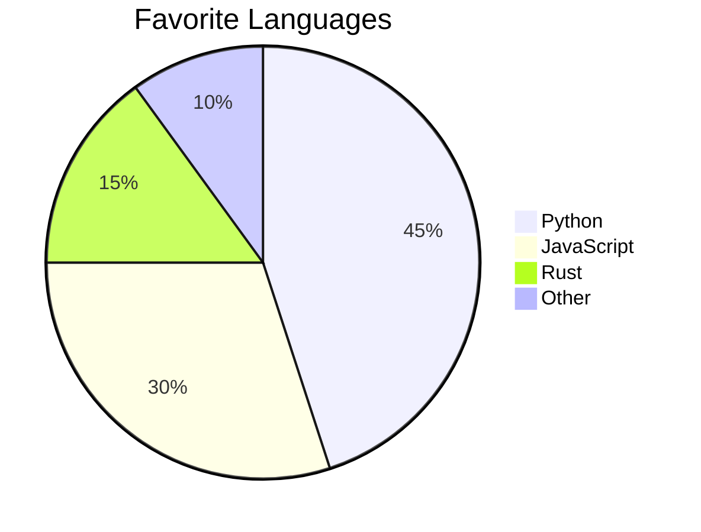

# Course Notes — Astro Starlight

Personal documentation site for **[Course Name]**, built with [Astro Starlight](https://starlight.astro.build/).

Clone this template for each course. See the astro config comments for how to customize.

## Prerequisites

- [Node.js](https://nodejs.org/) v18 or later
- npm (comes with Node.js)

## Building & Running Locally

```bash
# 1. Clone the repo
git clone https://github.com/yourusername/your-notes-repo.git
cd your-notes-repo

# 2. Install dependencies
npm install

# 3. Start the dev server
npm run dev
```

This launches a local server at `http://localhost:4321` with hot reload — any changes you save to `.md` files will appear instantly in the browser.

To generate a production build (static HTML/CSS/JS):

```bash
npm run build
```

The output goes to `dist/`. You can preview it locally with:

```bash
npm run preview
```

## Adding a New Page

**Option A — Manual:**

1. Create a `.md` file in `src/content/docs/` (in the right folder)
2. Add frontmatter with at least a `title`
3. Add a sidebar entry in `astro.config.mjs`

**Option B — Script:**

```bash
npm run notes
```

Follow the prompts. It creates the file and tells you what to add to the sidebar.

## Adding a New Section

1. Create a new folder under `src/content/docs/`
2. Add an `index.md` inside it
3. Add a new sidebar group in `astro.config.mjs`
4. Update the `SECTIONS` array in `scripts/new-note.mjs`

## Math / LaTeX Support (Optional)

If your course involves math, you can enable LaTeX rendering using the [`starlight-katex`](https://github.com/stereobooster/starlight-katex) plugin. This lets you write equations directly in your markdown using `$...$` for inline math and `$$...$$` for block equations.

> **Note:** The standard `remark-math` + `rehype-katex` approach that works in vanilla Astro [has known issues with Starlight](https://github.com/withastro/starlight/discussions/3455). The `starlight-katex` plugin handles all the necessary configuration automatically.

**1. Install the plugin:**

```bash
npm install starlight-katex
```

**2. Update `astro.config.mjs`:**

Add the import at the top of the file and the plugin to your Starlight config:

```js
import { defineConfig } from "astro/config";
import starlight from "@astrojs/starlight";
import { starlightKatex } from "starlight-katex";

export default defineConfig({
  integrations: [
    starlight({
      title: "Course Notes",
      plugins: [starlightKatex()],
      // ... rest of your starlight config
    }),
  ],
});
```

**3. Use it in your markdown:**

Write `$E = mc^2$` for inline math, or use double dollar signs for block equations:

```markdown
$$
\int_0^\infty e^{-x^2} dx = \frac{\sqrt{\pi}}{2}
$$
```

See the example page at `src/content/docs/notes/example.md` for more syntax examples.

## Diagrams / Charts with Mermaid (Optional)

If your course uses diagrams, flowcharts, or charts (e.g., statistics, data structures, process flows), you can enable [Mermaid](https://mermaid.js.org/) support using the [`astro-mermaid`](https://github.com/joesaby/astro-mermaid) integration. This lets you write diagrams directly in your markdown using fenced code blocks.

**1. Install the integration:**

```bash
npm install astro-mermaid
```

**2. Update `astro.config.mjs`:**

Add the import at the top of the file and the integration to your Astro config. **Important:** `mermaid()` must come _before_ `starlight()` in the integrations array:

```js
import { defineConfig } from "astro/config";
import mermaid from "astro-mermaid";
import starlight from "@astrojs/starlight";

export default defineConfig({
  integrations: [
    mermaid(), // ⚠️ Must come BEFORE starlight
    starlight({
      title: "Course Notes",
      // ... rest of your starlight config
    }),
  ],
});
```

**3. Use it in your markdown:**

Write diagrams inside fenced code blocks with the `mermaid` language identifier:

````markdown

````

The integration handles light/dark theme switching automatically. See the example page at `src/content/docs/notes/example.md` for more diagram types, and the [Mermaid docs](https://mermaid.js.org/intro/) for the full syntax reference.

## Structure

```
src/content/docs/
├── index.md          ← Landing page
├── notes/            ← Lecture notes, readings
│   ├── index.md
│   └── example.md    ← Delete this once you're comfortable
└── resources/        ← Reference materials, formulas
    └── index.md
```

## A Note on Course Content

This repo is a **template** — it doesn't contain any course material. If you use it to take notes for a class, be mindful before deploying or publishing your notes publicly. Lecture slides, exam questions, textbook excerpts, and other instructor-created materials are often copyrighted or protected by your university's academic integrity policies. When in doubt, keep your notes repo private and run it locally.

## License

This template is released under the [MIT License](LICENSE).
