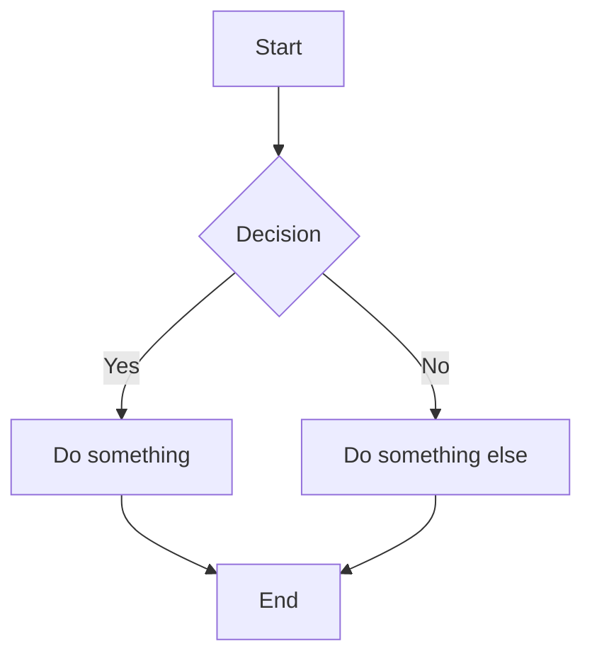
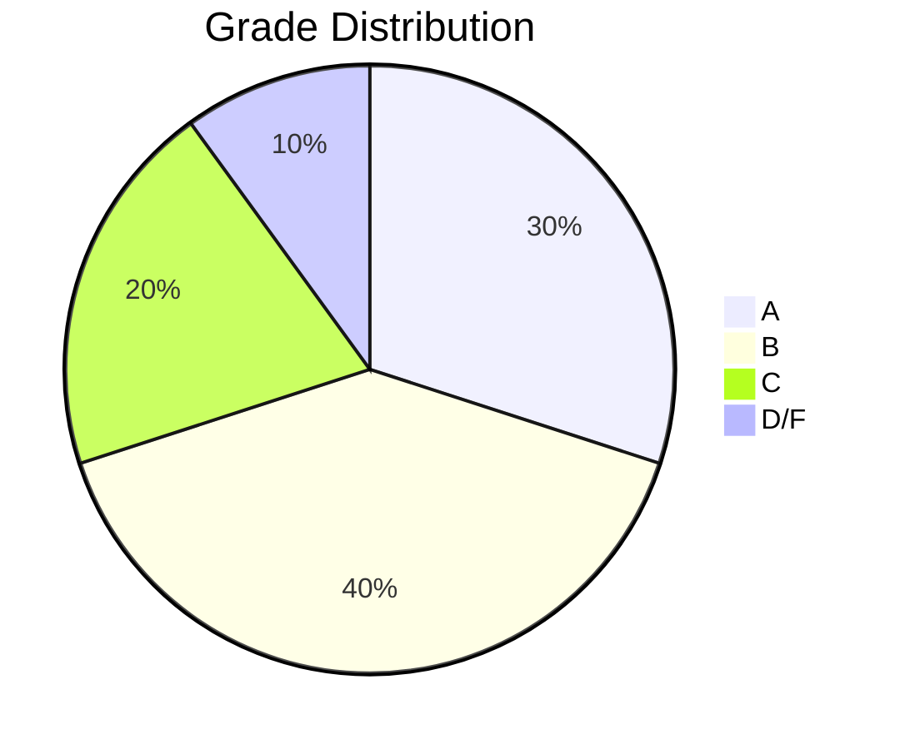
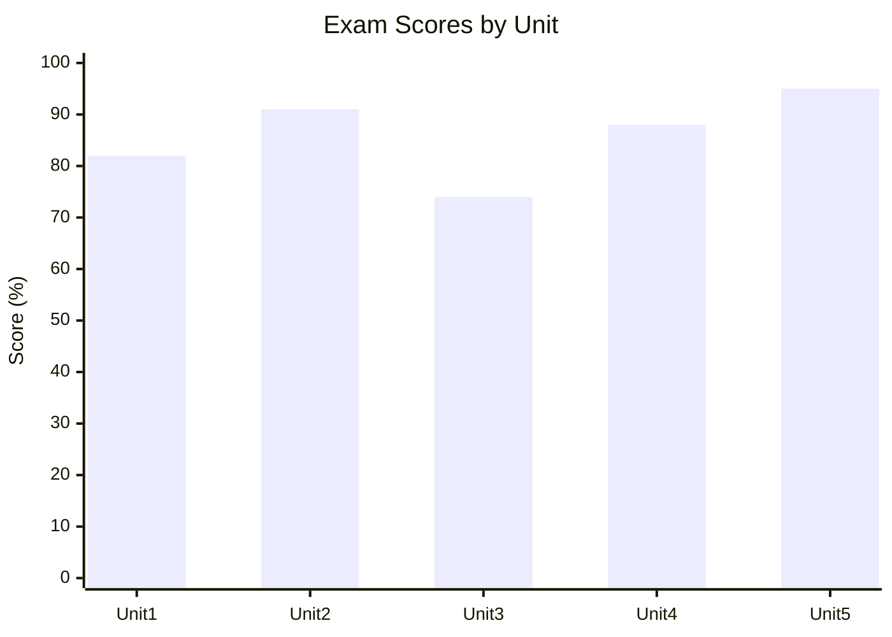
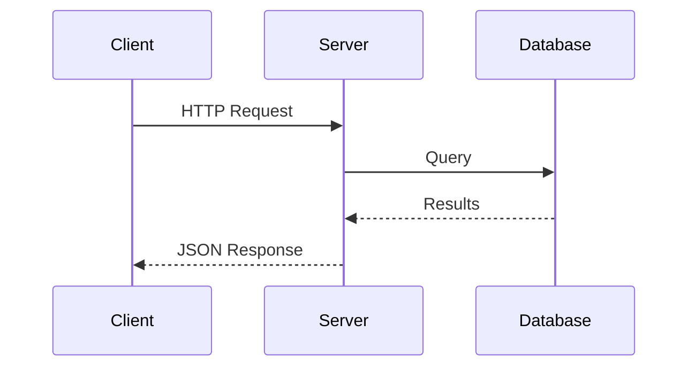
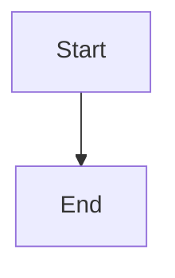

This is an example page showing the formatting you can use in your notes. Delete this file (and its sidebar entry in `astro.config.mjs`) once you don't need it anymore.

## Basic Formatting

Regular paragraphs work as expected. You can use **bold**, _italics_, `inline code`, and [links](https://example.com).

## Code Blocks

Use triple backticks with a language identifier:

```python
def hello():
    print("Hello, world!")
```

```bash
echo "You can use any language identifier"
```

## Tables

| Term     | Definition                       |
| -------- | -------------------------------- |
| Example  | A thing that serves as a pattern |
| Template | A preset format for a document   |

## Admonitions

Starlight supports these natively in markdown — no imports needed:

:::tip
This is a tip. Use it for helpful hints.
:::

:::note
This is a note. Use it for supplementary info.
:::

:::caution
This is a caution. Use it for things to watch out for.
:::

:::danger
This is a danger warning. Use it for critical warnings.
:::

## Task Lists

- [ ] Read chapter 1
- [ ] Complete homework
- [x] Set up notes repo

## Images

Store images in `src/assets/images/` and reference them with a relative path:

```markdown

```

## Math / LaTeX (Optional Setup Required)

Starlight doesn't render LaTeX by default. If your course is math-heavy, you can enable it with the [`starlight-katex`](https://github.com/stereobooster/starlight-katex) plugin — see the [README setup instructions](https://github.com/yourusername/your-notes-repo#math--latex-support-optional) for details.

### Live Examples

If KaTeX is set up correctly, you should see rendered equations below — not raw dollar signs.

**Inline math:** Euler's identity is $e^{i\pi} + 1 = 0$, and the quadratic formula is $x = \frac{-b \pm \sqrt{b^2 - 4ac}}{2a}$.

**A summation:** $\sum_{n=1}^{\infty} \frac{1}{n^2} = \frac{\pi^2}{6}$

**A block equation:**

$$
\int_0^\infty e^{-x^2} dx = \frac{\sqrt{\pi}}{2}
$$

**A matrix:**

$$
A = \begin{bmatrix} 1 & 2 \\ 3 & 4 \end{bmatrix}
$$

**A system of equations:**

$$
\begin{aligned}
2x + 3y &= 7 \\
x - y &= 1
\end{aligned}
$$

:::note
If the math above shows raw dollar signs instead of formatted equations, KaTeX is not set up yet. See the README for installation steps.
:::

### Syntax Reference

Here's how to write the examples above in your markdown files:

**Inline math** — wrap with single `$` signs:

```markdown
Euler's identity is $e^{i\pi} + 1 = 0$.
```

**Block equations** — use `$$` on their own lines:

```markdown
$$
\int_0^\infty e^{-x^2} dx = \frac{\sqrt{\pi}}{2}
$$
```

**Common LaTeX commands:**

| Command                           | Result            | Use for        |
| --------------------------------- | ----------------- | -------------- |
| `\frac{a}{b}`                     | Fraction          | Division       |
| `\sqrt{x}`                        | Square root       | Roots          |
| `x^{2}`                           | Superscript       | Exponents      |
| `x_{i}`                           | Subscript         | Indices        |
| `\sum`                            | Summation         | Series         |
| `\int`                            | Integral          | Calculus       |
| `\alpha, \beta, \theta`           | Greek letters     | Variables      |
| `\begin{bmatrix}...\end{bmatrix}` | Matrix            | Linear algebra |
| `\begin{aligned}...\end{aligned}` | Aligned equations | Systems        |

## Diagrams / Charts with Mermaid (Optional Setup Required)

Starlight doesn't render Mermaid diagrams by default. If your course uses diagrams, flowcharts, or charts, you can enable it with the [`astro-mermaid`](https://github.com/joesaby/astro-mermaid) integration — see the [README setup instructions](https://github.com/yourusername/your-notes-repo#diagrams--charts-with-mermaid-optional) for details.

### Live Examples

If Mermaid is set up correctly, you should see rendered diagrams below — not raw text.

**Flowchart:**



**Pie chart:**



**Bar chart:**



**Sequence diagram:**



:::note
If the diagrams above show raw text instead of rendered graphics, Mermaid is not set up yet. See the README for installation steps.
:::

### Syntax Reference

Write diagrams inside fenced code blocks with the `mermaid` language identifier:

````markdown

````

**Common diagram types:**

| Type                | Keyword           | Use for                               |
| ------------------- | ----------------- | ------------------------------------- |
| Flowchart           | `graph TD`        | Processes, algorithms, decision trees |
| Pie chart           | `pie`             | Proportions, distributions            |
| Bar chart           | `xychart-beta`    | Comparisons, trends over categories   |
| Sequence diagram    | `sequenceDiagram` | Interactions between components       |
| Class diagram       | `classDiagram`    | OOP structures, relationships         |
| State diagram       | `stateDiagram-v2` | State machines, lifecycles            |
| Entity relationship | `erDiagram`       | Database schemas                      |
| Gantt chart         | `gantt`           | Project timelines, schedules          |

See the [Mermaid docs](https://mermaid.js.org/intro/) for the full syntax reference.
